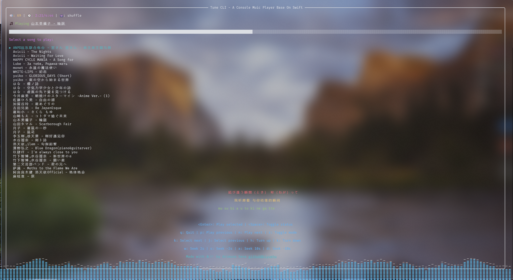

<!-- markdownlint-disable -->
<div align="center">

# TuneCLI


**Modern • Lightweight • Terminal Music Player**

[](https://github.com/ICEAGENB/ban-zhinese-using/) [](https://wakatime.com/badge/user/018dc603-712a-4205-a226-d4c9ccd0d02b/project/a4adb084-769c-42fb-966d-fe74d3b23121)

</div>
<!-- markdownlint-enable -->

## Advantages

- 🎵 Pure Console Rendering
- 🚀 Built with Swift for Performance
- 🎨 Modern Terminal UI with Colors and Animations

## Screenshot



## Usage

- Download from [Releases](https://github.com/biyuehu/TuneCLI/releases)

### Command Line Usage

- Base: swift-tune `<directory>` `[--shuffle]` `[--repeat-all]` `[--repeat-one]`
- `<directory>`: audio directory (default: ./audio)
- `[--shuffle]`: shuffle the song
- `[--repeat-all]`: repeat all the audio song
- `[--repeat-one]`: repeat one audio song
- `-h`, `--help`: Show help information

### Key Bindings

- `<space>`: play/pause
- `<enter>`: play selected song
- `p`: previous song
- `n`: next song
- `r`: toggle playing mode
- `j`: select next
- `k`: select previous
- `h`: volume up
- `l`: volume down
- `w`: seek 2s
- `s`: seek -2s
- `a`: seek 10s
- `d`: seek -10s
- `q`: quit

### Lyrics

Put lyrics files in the same directory as the audio files with the same name, and the extension `.lrc`. For example:

```text
audio/
├── yuiko - GLORIOUS_DAYS (Short).mp3
├── yuiko - GLORIOUS_DAYS (Short).lrc
├── HAPPY CYCLE MANIA - A Song for....mp3
├── HAPPY CYCLE MANIA - A Song for....lrc
└── ...
```

## License

Under the [Ban-Zhinese-Using](https://github.com/ICEAGENB/ban-zhinese-using) License.
